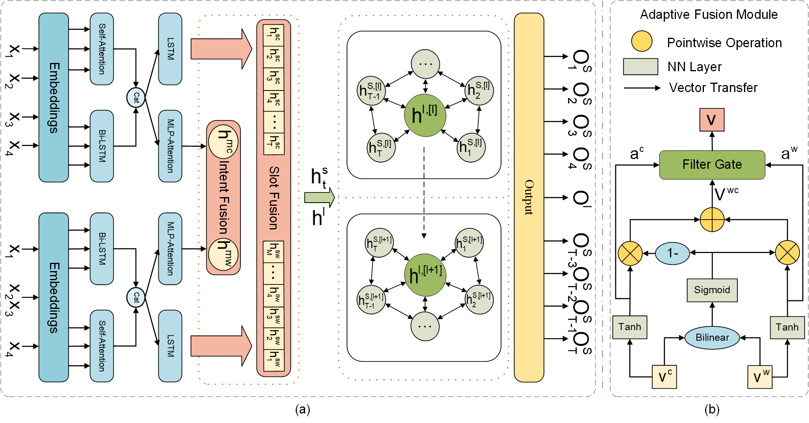

# BIG-FG-Chinese-SLU

This repository contains the PyTorch implementation of the paper: 

**A Novel Bi-directional Interaction Graph Framework with Filter Gate Mechanism for Chinese Spoken Language Understanding**. 
Wentao Zhang, Bi Zeng, Pengfei Wei, Huiting Hu. 

## Architecture



## Requirements

Our code is based on Python 3.7.6 and PyTorch 1.1. Requirements are listed as follows:
> - torch==1.1.0
> - transformers==2.4.1
> - numpy==1.18.1
> - tqdm==4.42.1
> - seqeval==0.0.12

We highly suggest you using [Anaconda](https://www.anaconda.com) to manage your python environment.

## How to Run it

### Quick start

The script **train.py** acts as a main function to the project, you can run the experiments by replacing the unspecified options in the following command with the corresponding values.

```shell
    CUDA_VISIBLE_DEVICES=$1 python train.py -dd ${dataDir} -sd ${saveDir} -u -bs 16 -dr 0.3 \ 
        -ced 128 -wed 128 -ehd 512 -aod 128 -sed 32 -sdhd 64
```


Due to some stochastic factors, It's necessary to slightly tune the hyper-parameters using grid search. If you have any question, please issue the project or email [me](zwt@mail2.gdut.edu.cn) and we will reply you soon.

## Issues/PRs/Questions

Feel free to contact [me](zwt@mail2.gdut.edu.cn) for any question or create issues/prs.

## Acknowledgement

<[AaronTengDeChuan/MLWA-Chinese-SLU: Open source code for ICASSP 2021 Paper “Injecting Word Information with Multi-Level Word Adapter for Chinese Spoken Language Understanding” (github.com)](https://github.com/AaronTengDeChuan/MLWA-Chinese-SLU)>

We are very grateful for their pytorch implementation of MLWA Framework for Spoken Language Understanding.
